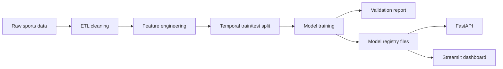

# Architecture

## Data Flow

## Components

`sports_predictor.data_collection` handles collection, sample data, cleaning, outlier clipping, missing values, and SQLite schema creation.

`sports_predictor.feature_engineering` builds rolling averages, rolling standard deviation, EWMA, lag features, momentum, acceleration, career average, season average, opposition average, injury risk, rest days, and home/away context.

`sports_predictor.models` trains one model bundle per sport. Each bundle contains an ensemble regressor, lower and upper quantile regressors for 80% intervals, selected feature columns, validation metrics, and permutation feature importance.

`sports_predictor.prediction_service` is the shared inference layer used by both API and dashboard.

## Production Path

For production, replace generated sample data with scheduled data collectors, persist raw and modeled data in PostgreSQL, add Redis caching around inference, run training on a schedule, and ship the API using the included Dockerfile.
